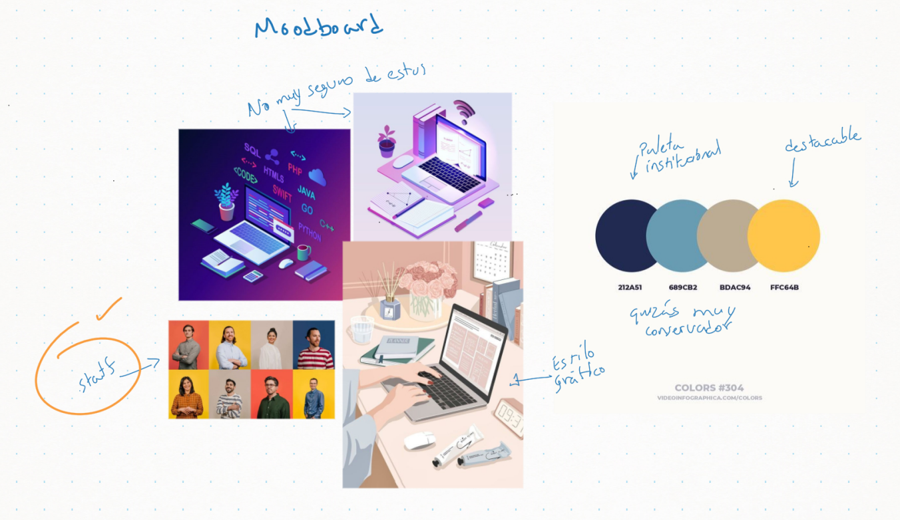
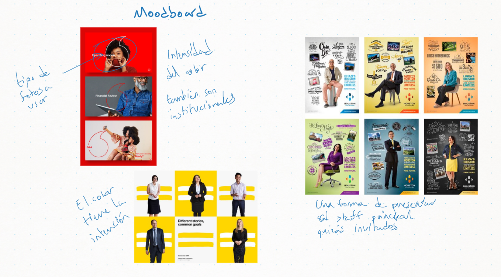
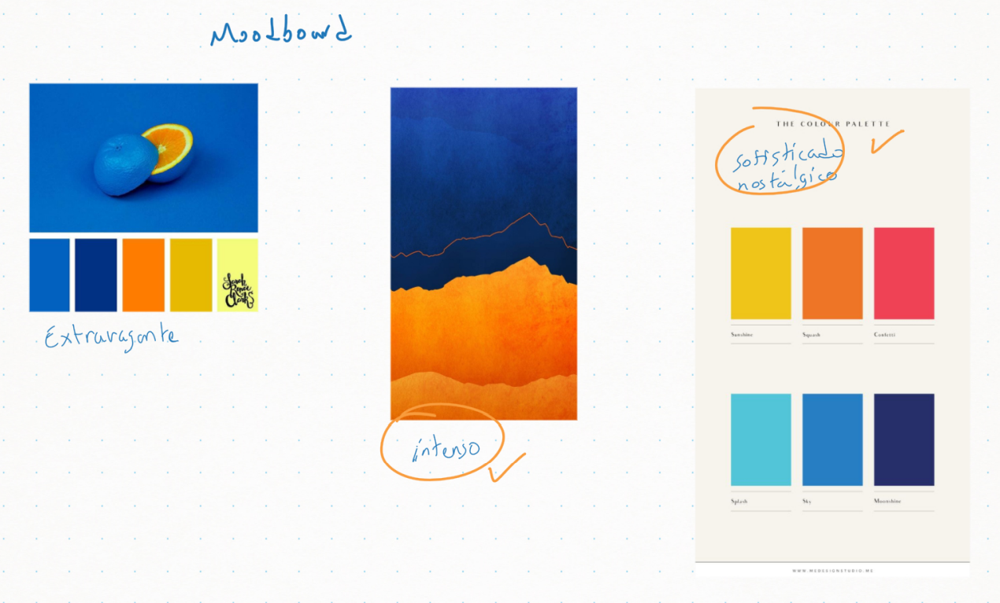
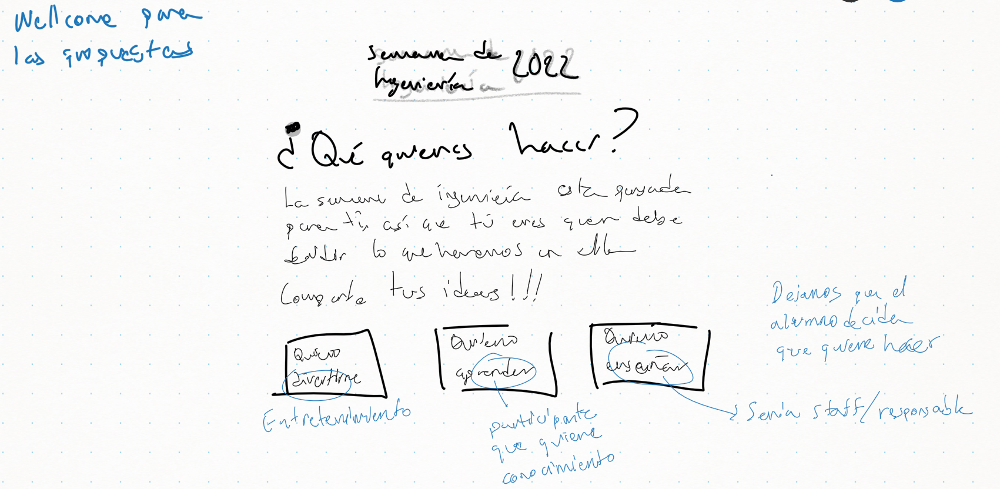
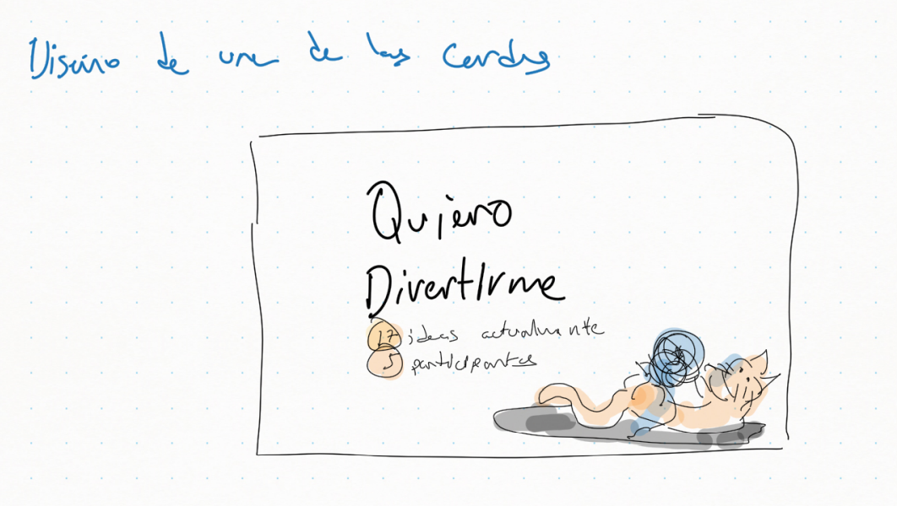
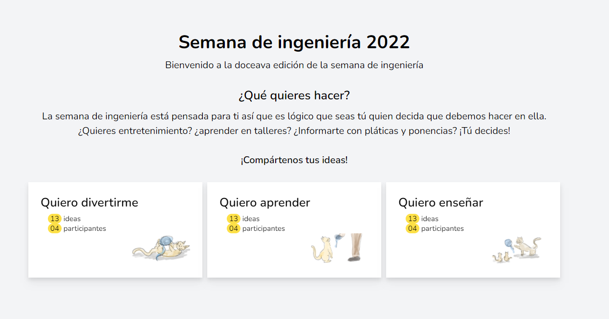

# Briefing del proyecto

La semana de ingeniería del ITS Motul es un evento anual que enmarca actividades del área tecnológica principalmente. En principio debe ser un evento para promover las tendencias en tecnología, mostrar avances y desarrollos y también tener algo de entretenimiento.

La duración ideal del evento debe ser una semana por lo que hay tiempo y espacio para diversas actividades. Algunas universidades tienen un esquema de inscripción con pago para ellas otras son totalmente gratuitas. Entre una y otra la _calidad_ de las actividades propuestas se notará en función de los recursos destinados. Estos recursos son económicos, tecnológicos y humanos. 

Buscar un equilibrio entre ellos será primordial para enaltecer el evento.

## Aplicando el design thinking

Usando el pensamiento de diseñador habremos de seguir las etapas del proceso: _empatía, definición, ideación, prototipado y testeo_. Estas etapas pueden ser abordadas en cualquier punto según las condiciones iniciales del proyecto. En este caso, la semana de ingeniería ya existe y tiene sus ediciones pasadas para tener algo de contraste con las nuevas ideas a proponer por lo que podría comenzarse un prototipo, testearlo y volver a la empatía y continuar el proceso de nuevo.

!!! 
No olvidar que el __design thinking__ es un proceso iterativo y nunca se resuelve en una sola ejecución 
!!!

### Empatía

Algunas de las _ideas preconcebidas_ y otras obtenidas por el análisis introspectivo de los estudiantes a cargo del proyecto son las siguientes:

- Muchos estudiantes son introvertidos y por eso no participan
- Algunos son antisociales
- No han desarrollado _identidad_ con el instituto por lo que no se interesan
- Apatía generalizada por falta de creatividad en estos eventos
- Esperan una recompensa para participar
- Prefieren el _día libre_ aunque no hagan nada con ello
- Participar es más un asunto de personalidad del individuo
- Solo si tienen interés personal, pero nuevamente, responde a su personalidad
- Algunos tienen actitud de servicio y por eso son propensos a participar
- Si se lo solicita algún profesor que respeten aceptarán
- Desean _formar parte_ de algo _interesante_.
- Algunos solo buscan una excusa para reunirse con amigos
- Otros quieren conocer gente nueva
- Otros más quieren _ganar puntos_ con profesores o directivos
- Unos tienen deseos de competir
- Quieren hacer algo fuera de lo habitual
- Se desea inconscientemente el reconocimiento social 

### Definición

Usando la técnica de las __4 w's__ que son preguntas para formalizar un enunciado con el objetivo del proyecto se ha llegado a lo siguiente:

> Los alumnos del instituto tecnológico superior de Motul sienten apatía general por los eventos de corte académico como la semana de ingeniería porque no aportan nada nuevo últimamente y esto se refleja en una baja disposición para participar tanto como _público objetivo_ o como _staff o equipo de apoyo_.

Algunos _insights_ que podemos seguir también en este tenor:

- Lo mismo de siempre por los mismos de siempre. Se requiere variedad.
- _Quizás hay demasiados interesados en ser staff_ (idea contradictoria para pensar diferente en la ideación)
- Formar parte de la organización del evento aumentará el compromiso de participación.
- ¿por qué debería hacer algo extra?

### Ideación

Este conjunto de ideas se obtuvo por diversas técnicas, pero la más utilizada fué el _brainstorming_. Se requiere mejorar el uso de técnicas para obtener ideas más creativas.

Para el tema de __generar ideas__ para que los participantes se involucren en el evento se tiene lo siguiente:

- Contar las ideas más repetidas. Podría indicar lo más exitoso del evento.
- Reconocimiento a quienes proponen las ideas que se utilizan. Refuerza el reconocimiento social y la identidad institucional.
- Formar equipos con una idea. La _protección_ de grupo facilitaría la participación y al mismo tiempo podría crearse el _staff_ de dicha actividad.
- Competir contra los profesores. Un espacio y momento para tomar _revancha_ con los profesores. Una idea tan clásica como efectiva.
- Propiciar actividades diversas como ventas, exposición de productos, etc. Más es mejor.
- Modalidad de feria. En concordancia con lo anterior, más la idea de que puedes _pasar el día_ en el instituto.
- Ganar insignias. Un elemento de _gamificación_ que es muy valioso en el mundo gamer y fuera de él también.
- Registrar historias/anécdotas ocurridas durante la semana. El juego de la nostalgia que además encaja con el proyecto del _anecdotario_.
- Recordar a los ganadores de eventos anteriores. Este ranking que nos permitirá hacer una tradición del evento.
- Relacionar participación con apoyo en asignaturas. Una solicitud típica del estudiante. _Requiere mayor detalle para determinar si puede ser una idea útil_.
- Pase libre entre eventos. En algún momento tendremos actividades que sean VIP como en un concierto.
- Votaciones justas. Para elegir las mejores/peores ideas.
- La mejor peor idea. Una broma que puede ser un clásico.
- Igualar la cantidad de actividades lúdicas y de formación. Justo para el tema del evento.
- Esquema de _e-sport_. Analizar las particularidades de estos eventos para ver que podemos aplicar en el nuestro.
- _Destronar_ al ganador. Una idea de competitividad para cada año.
- Generar estadísticas y _numeralia_ del evento. Datos que pueden ser benéficos para quienes los leen.
- Aplicar _game awards_. Esto es _gamificación_ y encaja con algunos temas previos.

Para __formar equipo staff__ en el evento se tienen las siguientes:

- Explicar los detalles de la actividad al posible staff.
- Actividad obligatoria para _recursadores_. Más que obligar, incitar como una responsabilidad de los _más antiguos_ en el evento.
- Objetos conmemorativos / kits de bienvenida. Playeras u otros elementos que los destaquen como un equipo.
- Asignar _roles_ al staff. Quizás tener nombres, etiquetas o rangos  (como en los juegos) resulte atractivo.
- Ser staff con tu equipo. No te inscribes solo, sino con tus amigos.
- Ver si un amigo ya está registrado. De nuevo, los amigos atraen.
- _Conocer los motivos para no participar_. Esta idea servirá para saber porque no quieren estar ahí.
- Limitar las responsabilidades. Indicar el nivel de responsabilidad esperado así según la personalidad y actitud tendremos al alumno correcto.
- Elegir donde participar. El staff podría estar interesado en una actividad en específico o quizás no.
- Generar memes con el staff. Quizás darles el derecho a producir memes de los invitados.
- Convocatoria anticipada. Hacer esto desde mucho antes que se produzca el evento podría resolver problemas de falta/exceso de capital humano.
- Imagen conmemorativa del staff. Reconocimiento visual del equipo. Algo como tu _team_ en un juego en línea que sirve para tener nuevamente identidad.
_ Uso de redes sociales en el evento. Para ganar notoriedad.
- Usar una mascota. El personaje de _poncho tec_ tiene esa función. Puede ser él o uno para el evento.

### Prototipos

Presentar visualmente las ideas es lo más eficiente que tratar de explicarlas en muchos casos. Uso de bocetos rápidos o programas gráficos de maquetación son útiles en esta etapa. Se espera _rapidez sobre calidad_ en la representación visual. 

El __moodboard__ es una técnica útil en esta etapa porque ayuda a _sugerir_ lo que se quiere lograr.

!!!
Generar bocetos rápidos son útiles, algunos servirán para presentar la idea no necesariamente son las versiones finales pero __siempre deben estar enlazados con las ideas, la definición o la empatía__ que se ha generado hasta el momento o de lo contrario no serán útiles
!!!

> Los ejemplos anteriores muestran _vistas aisladas_ pero representan algunas de las ideas. 

Descarga el documento con las ideas, bocetos y moodboard del proyecto.

[!file](../../archivos/mockups.pdf)