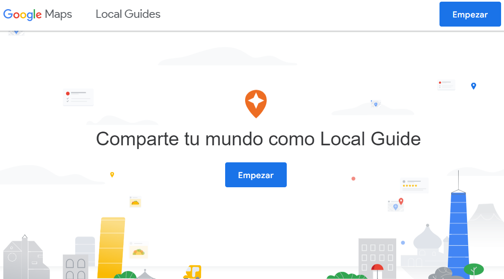
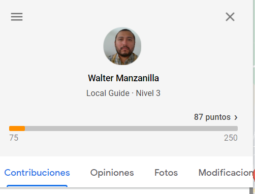
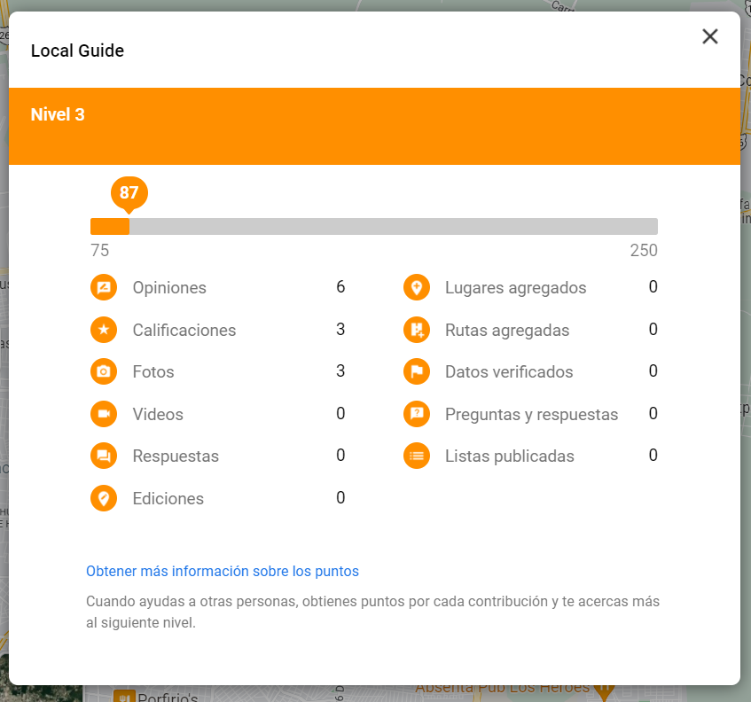
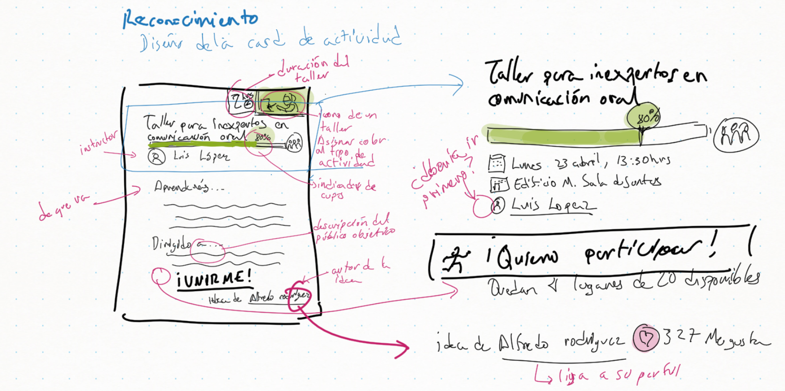
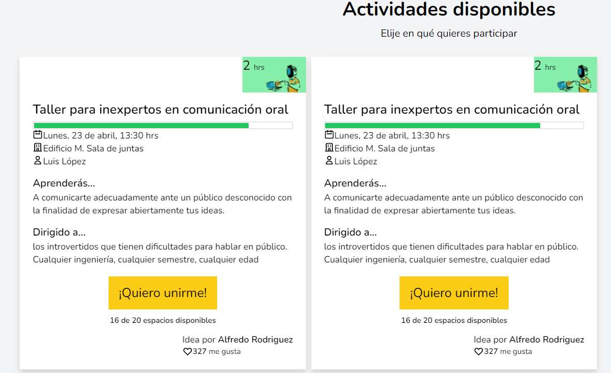

# Prototipo

El prototipo comienza con bocetos rápidos que ilustran las ideas que serán implementadas en el proyecto. Estos bocetos derivarán en un _paper prototyping_ rápido que mostrará la funcionalidad ideal del proyecto.

Revisa este documento con las ideas bocetadas hasta el momento para este proyecto.

[!file](../../../archivos/mockups.pdf)

!!!
Agregar comentarios a los bocetos y observaciones después del análisis es fundamental para que terceros comprendan lo que quieren representar.
!!!

!!!
Versiona cada conjunto de bocetos cuando consideres que has creado un nuevo concepto o que los cambios son lo suficientemente notorios para demostrar que la aplicación/proyecto ha evolucionado.
!!!

!!!
Utiliza un __cuaderno de bocetos__ único para el proyecto. Esto será en extremo útil para generar las evidencias y tener el control de avance.
!!!

## preparando ideas

Elijamos una de las ideas para pensar en su representación:

> Reconocimiento a quienes proponen las ideas que se utilizan. Refuerza el reconocimiento social y la identidad institucional.

Esto es relativamente fácil, habría que agregar el nombre del alumno a la actividad. Pero, ¿qué pasa si el alumno no quiere aparecer? Recordemos que algunos son introvertidos y quizás tienen _ansiedad social_, entonces, ¿cómo les damos reconocimiento? ¿No lo quieren? Por empatía sabríamos que si quieren reconocimiento solo no saben cómo lidiar con él. Aquí podríamos pensar en permitir el _anonimato_ o usar quizás un _alias_ para saber que es él sin saber quién es él. ¿En qué momento preguntaremos esto? ¿desde el formulario de registro de la idea? ¿en otra etapa? ¿hasta que se seleccione?

!!!
En el párrafo anterior hemos repetido todas las fases del design thinking (excepto el prototipo y el testeo)
!!!

### Inspiración

Buscar inspiración es importante para pensar en las soluciones. El __moodboard__ es el resultado de esta actividad. Existe al menos un par de técnicas del design thinking que encajan con esto. 

En este ejemplo tomaremos el servicio de _local guides_ de Google. Este servicio de Google le pide a los usuarios de Google Maps que se vuelvan _guías locales_ para quienes van a los lugares que el usuario ha visitado. Esto esencialmente sirve para obtener opiniones que ayuden a decidir a los viajeros si hacer o no dicho viaje. 

Al margen de su finalidad, el título de _guía local_ sirve para _empoderar_ al usuario y darle un rol que vale más que solo pedirle su opinión en un formulario. La elección de participar es del usuario, él puede negarse, pero es posible que muchos se sientan atraídos por la solicitud de ayuda. En las vistas disponibles para el usuario que participan de guía se pueden ver sus estadísticas y un _rango_ logrado por lo que ha hecho hasta el momento. Vemos la intención de reconocer la participación sin dar mayores premios que el reconocimiento mismo. El puntaje también es competitividad aunque no se muestre contra otros usuarios.

!!!
Nota al margen: El color base es naranja. La teoría del color nos dice que es por la diversión (18%) y sociabilidad (20%) la extroversión (19%) y actividad(18%)
!!!

Algunas de las ideas que también quedan enlazadas son:

- Registrar historias/anécdotas ocurridas durante la semana. 
- Contar las ideas más repetidas. 
- Ganar insignias.
- Generar estadísticas y _numeralia_ del evento. 
- Asignar _roles_ al staff.
- Elegir donde participar.
- Convocatoria anticipada. 

!!!
Nota al margen: Aunque son buenas ideas no salen de lo convencional. 
!!!

Podemos representar la card de las actividades:

- ícono de la actividad.
- Duración de la actividad. Para facilitar la decisión.
- Indicador visual de llenado de cupo.
- Al pie de la card el _autor de la idea_.
- Información detallada de la actividad: qué es, para quién es, lugar, día, instructor.

## Bocetos

El resultado del análisis anterior se refleja en estas imágenes.

El resultado en maqueta con HTML y CSS solamente es el siguiente:

Estas siguen siendo ideas preliminares. Deben seguir refinándose.