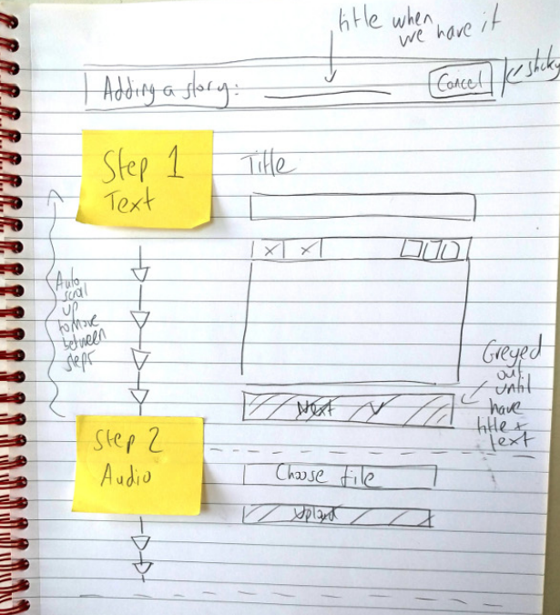

# ¿Qué es un prototipo?

Es algo que creamos para probar, explorar o comunicar ideas de diseño para _algo_ que está siendo diseñado.

Normalmente es algo de _baja fidelidad_ como lo que se consigue con el _paper prototyping_ en el caso de los bocetos de diseño web. Pueden ser:

- sketchs o bocetos
- wireframes que representan estructuras de páginas o grids.
- mockups que son mucho más visuales y pueden tener cierta interacción _ficticia_.
- una aplicación mínimamente funcional que _omite_ muchos elementos (de seguridad principalmente) para ilustrar el comportamiento ideal. 
- una combinación de todas o algunas de las anteriores.

## ¿Por qué usar prototipos?

Sirven para mucho, por ejemplo:

- Testeo y presentación del diseño de interfaces web
- Ahorra tiempo y dinero
- Atrae al usuario/cliente al proceso de diseño
- Engancha a los _stakeholders_ en el proceso
- Permite visualizar el resultado en diferentes plataformas
- Probar la funcionalidad con información real pero en ambiente controlado

### Arquitectura de información y elementos estructurales

Con un prototipo se puede revisar el cómo está distribuido el contenido en el sitio/aplicación:

- La jerarquía de las páginas del sitio
- El comportamiento de la navegación
- Las etiquetas utilizadas y su comprensión por parte de los usuarios

### Layouts y jerarquía visual

Los prototipos también servirán para visualizar la distribución del contenido dentro de una página y cómo se organizan visualmente entre ellos.

Los elementos elegidos a mostrar dentro de una vista pueden ordenarse de distintas maneras, de la misma forma que cada quién puede organizar su closet como mejor le convenga, entonces, ¿cómo saber cuál es la mejor distribución? para eso usamos los prototipos.

## Recursos de diseño existentes

Existen recursos de diseño que puedes utilizar en el proceso de diseñar y construir prototipos. Estos recursos van en el orden de:

- Información _background_ relevante. Puede haber un briefing previo, un proyecto activo, un equipo de trabajo que ya ha trabajado en el proyecto, objetivos establecidos por la gerencia, etc.
- Investigación de mercado/usuarios publicadas. Muchas agencias realizan estudios de mercado y publicando sus resultados. Estos datos pueden resolver muchos de tus problemas de diseño. 
- Arquitecturas de información preestablecidas. Ciertos proyectos tienen esquemas que siempre funcionan o son convención de uso. Hay taxonomías, guías de etiquetado, terminología aceptada, lenguaje aplicado, algunos resultado se pueden obtener con técnicas de _card sorting_ para sugerir navegación y layouts por ejemplo.
- Guías de _branding_ en el caso de marcas que lo tienen definido. Ciertas marcas tienen reglas que deben respetarse en el uso de logotipos, frases, tipografía y colores por citar algo.
- Bocetos, wireframes y mockups de uso extendido. Solo hay que replicarlos.

