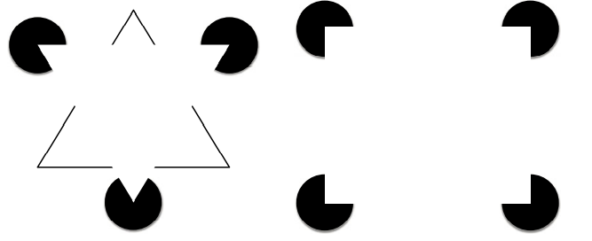

# cómo ven las personas

La vista es el sentido predominante. Pero lo que percibes a través de tus ojos es solo el principio. Lo que ves y lo que se interpreta son cosas distintas.

## Lo que el cerebro entiende

El cerebro interpreta lo que percibe la vista. Las ilusiones ópticas toman ventaja de esto. El triángulo Kanizsa se basa en este principio. Es posible ver los triángulos __que no están ahí__. De acuerdo a la experiencia sensorial el cerebro _completa_ lo que cree que falta en una forma.

Bajo este principio se __puede influenciar lo que la gente ve con lo que uno quiere que vea__.

!!!
Lo que piensas que verá un visitante de tu sitio web no es lo que necesariamente él verá en realidad. Esto depende de su experiencia, conocimiento, familiaridad y expectativas sobre el sitio.
!!!

## Visión periférica

La visión es central y periférica. La visión central se enfoca en lo que ves directamente y en los detalles. La visión periférica se fija en todo lo demás. La visión periférica es la que nos da la _noción general_ de lo que vemos. 

En un sitio web los anuncios colocados en los banners laterales o que están fuera del contenido principal suelen ser animados o _parpadeantes_ para atraer la atención por medio de su efecto de _alerta_ en la visión periférica.

!!!
Una persona usa la visión periférica al ver un sitio web. Esta le permite tener una visión _global_ del sitio y decidir si es lo que busca o no.
!!!

!!!
Si bien lo más importante está al centro de la pantalla, los elementos que se coloquen en la _periferia_ serán _observados_ por la visión periférica y tendrán repercusión sobre las decisiones del usuario.
!!!

!!!
Para _concentrarse_ evita elementos _ruidosos_ en la periferia de la página
!!!

## Se reconocen objetos porque se reconocen patrones

El cerebro busca patrones para lo que ve lo que facilita su interpretación. Cuando ves personas en un lugar tu cerebro los _agrupa_ según su cercanía, su color o  cualquier otro criterio que destaque en la escena.

> ...research now suggests that you recognize basic shapes in what you are looking at, and use these basic shapes, called geometric icons (or geons), to identify objects

!!!
Usa patrones. En la mayoría de los casos es la solución más eficiente. El _agrupamiento_ y el _espacio negativo_ ayudan mucho.
!!!

!!!
Formas geométricas básicas como parte del diseño facilitan el reconocimiento. Piensa en los personajes de ciertas caricaturas y las formas que los componen.
!!!

!!!
Los objetos en 2D se reconocen mejor y más rápido que los objetos en 3D
!!!

## Una parte del cerebro para los rostros

Las investigaciones dicen que una parte del cerebro está dedicada únicamente a analizar y reconocer rostros. Así podemos ver sus emociones, expresiones y demás detalles explícitos e implícitos en ellos. 

!!!
Las pruebas de _eyetracking_ indican que si una imagen tiene un rostro mirando algo es casi seguro que mirarás lo que ese rostro mira. Aunque esto no asegura la atención al objeto en cuestión es un inicio para _dirigir_ la atención de las personas.
!!!

!!!
Los rostros son lo que más rápido se reconoce y a lo que más se reacciona. Excepto por los autistas. Las emociones transmitidas también se percibirán. Excepto por los autistas.
!!!

## Los objetos se _imaginan_ en perspectiva

La mayoría de las personas representará los objetos como imágenes con cierta perspectiva. Esta perspectiva se conoce como _perspectiva canónica_. Úsala tanto como te resulte posible en los elementos gráficos de tu sitio web.

## Se _escanea_ una página con base en la experiencia y la expectativa

En un sitio web hay ciertos elementos que se espera encontrar en lugares concretos. Logotipo en la esquina superior izquierda, acceso a _login_ en la superior derecha, mensaje más importante en el centro izquierda, etc.

Estos son los modelos mentales que se forman con la experiencia y que se usan para comparar lo que se ve como nuevo.

## Busca pistas de lo que un objeto hace

Al ver un pomo de puerta el movimiento inmediato es un giro a la ¿izquierda? ¿derecha? para abrir. Si el movimiento no es reconocido tendremos un problema. La mayoría de los objetos sugieren la forma de uso. La forma, tamaño y posición sugeriran si el pomo se _jala_ o _empuja_ o incluso si se _gira_. Las pistas son conocidas como _affordances_. 

¿Cuál es el affordance un botón? ¿de qué se basa ese comportamiento? ¿cómo se percibe esa _pista_ en el diseño del botón? Las sombras y espacio alrededor de la imagen o texto darán la sensación de profundidad que nos hará suponer que es un área _presionable_, como en los botones de un control remoto.

Ciertos diseños eliminan esas pistas para algo _clickeable_ en función de la estética. El resultado puede ser confuso para la mayoría de los usuarios, pero quizás funcione para el _público objetivo_ del sitio. Desechar los principios del affordance en el diseño supone un mayor compromiso del visitante.

!!!
Piensa siempre en el _affordance_ que mejor representa tu diseño. Darle las pistas adecuadas al visitante facilitará la aceptación del sitio.
!!!

!!!
las sombras indicarán elementos clickeables
!!!

!!!
Comprueba que los _affordances_ aplicados funcionen para el medio y para el público al que te diriges
!!!

## Se pueden _ignorar_ cambios en el campo de visión

Todos hemos visto algún video donde al verlo nuevamente notamos algo que pasamos por alto. O viceversa, no notamos lo que cambió entre una vista y otra. El video del gorila es un clásico para explicar esto y representa el _inattention blindness_ o _change blindness_ que es un tipo de _ceguera_ a los cambios o a lo _inesperado_ en una representación.

!!!
No asumas que todos ven lo que pusiste en la vista, puede ser que su _ceguera_ bloquee dicho elemento.
!!!

!!!
Agrega algún elemento extra para indicar que algo cambio en la vista como sonido o animación
!!!

## Las cosas que están cerca están juntas

Dos elementos que tienen mucha cercanía supondrán que están relacionados. Si no lo están, entonces hay un fallo de diseño. Aplica para todo, vemos en ocasiones personas que pasan demasiado tiempo juntos o están muy _cerca_ uno del otro y creemos que son pareja. A veces no lo son pero la pista sugiere que es así.

!!!
La proximidad es el elemento de jerarquía más útil para relacionar elementos. Puedes agrupar con cajas, separar con líneas, pero también sin ellas usando solamente un espacio limitado entre los elementos.
!!!

## Rojo y azul juntos duelen

La _chromostereopsis_ es un efecto que resulta de unir dos colores demasiado _chillones_ juntos. Usar rojo y azul para fondo y texto sin importar cuál sea cuál resultará en ello. __Evita siempre esta situación__. Usa herramientas para medir el contraste entre texto y fondo y que el resultado sea aceptable.

## No ven colores

9% de los hombres y 1.5% de las mujeres son _ciegos_ a los colores. Es decir, no perciben los colores como son reales. Esto es una deficiencia en el ojo para percibir uno de los tres colores primarios y todos los colores resultantes quedan alterados en su percepción. 

!!!
Usa herramientas para verificar si tu sitio genera suficiente contraste visual para las personas con este tipo de _ceguera_.
!!!

!!!
El color no puede ser tu único indicador. Utiliza también textos, sonidos o imágenes para resaltar el mensaje
!!!

## El significado del color también es cultural

La cultura cambia mucho el valor y significado que atribuimos a las cosas. Los colores también entran en esto y elegir tomando en cuenta el contexto es útil para evitar errores que pueden ser desastrosos.

